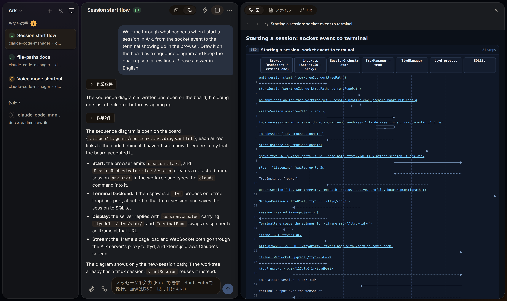
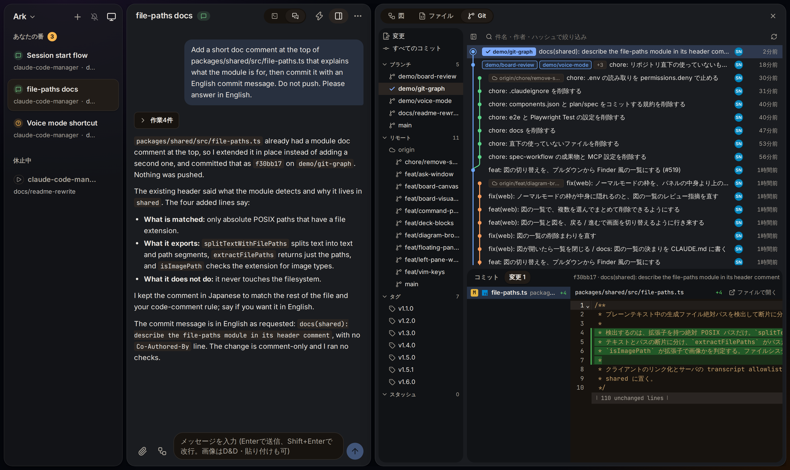
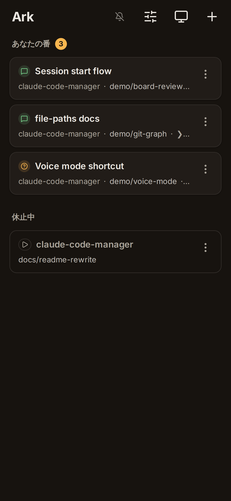
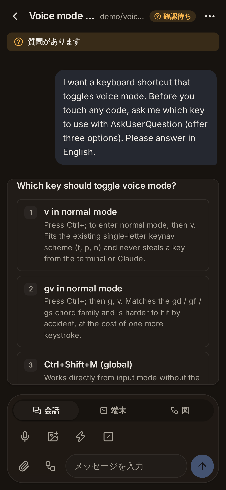

<div align="center">
  <h1>Ark</h1>
  <p><strong>手元で動くClaude Codeセッションの運転席</strong></p>
  <p>
    <a href="https://github.com/ignission/claude-code-ark/releases">Releases</a> ·
    <a href="https://github.com/ignission/claude-code-ark/issues">Issues</a> ·
    <a href="README.md">English</a>
  </p>
</div>

Arkは、git worktreeごとにClaude Codeのセッションを1つ動かし、そのすべてを1つの画面で見られるようにするセルフホストのWeb UIです。机のPCからもスマホからも同じセッションを操作できます。

動かしているのは、tmuxの中の対話版 `claude` CLIそのものです。プランも設定も `CLAUDE.md` も、ターミナルで使うときと同じように働きます。Agent SDKもAPIキーも使いません。

<p align="center">
  
</p>

> [!WARNING]
> Arkは実験的なプロジェクトで、**1人で使う**ことを前提にしています。認証を通過したクライアントはすべてのセッションに到達でき、localhostとプライベートIPからのアクセスは認証を省きます。複数人での共有は想定していません。トンネルで外に公開するときは十分に注意してください。

## Quickstart

1. Arkを入れます。macOS (Apple Silicon) では `brew install --cask ignission/tap/ark`、Linuxでは[ソースから起動](#ソースから起動)します。
2. Arkを開き (ソースから起動した場合は http://localhost:4001)、リポジトリを選んで、worktreeでセッションを始めます。
3. Claudeに話しかけます。会話の表示と生のターミナルは、上部のトグルで切り替えられます。

[Claude Code CLI](https://docs.claude.com/en/docs/claude-code) がインストール済みで、ログイン済みである必要があります (`claude --version` で確認し、未ログインなら `claude` を起動して `/login`)。

## 最初に試すこと

**変更の説明をボードに描かせる。** 図の矢印や行から、その裏のコードを開けます。

> セッションを始めたとき、socketのイベントからブラウザに端末が出るまでに何が起きるかを、シーケンス図でボードに描いて。

**キーボードで動かす。** `Ctrl+;` でノーマルモードに入り、`?` でキーの一覧を出します。`J` / `K` でセッションを前後に移り、`n` で次の「あなたの番」へ飛び、`:` でコマンドパレットを開きます。

**スマホから答える。** `pnpm start:quick` で起動してQRコードを読み取り、会話に出てくるカードからClaudeの質問に答えます。

## Arkを使う理由

### 開かなくても、各セッションの状況が分かる

サイドバーは、セッションを「あなたの番」「作業中」「休止中」に分けて並べます。Claudeが質問をすると、選択肢がボタンになったカードが出ます。カードには、質問の直前のターミナル画面がそのまま添えられます。

### 動いているのは本物のClaude Code

Arkはエージェントを作り直していません。各セッションは、detachedなtmuxセッションの中の対話版 `claude` CLIで、画面は [ttyd](https://github.com/tsl0922/ttyd) を通して見せています。会話の表示は、Claude自身が書くtranscriptのファイルから描きます。Arkのサーバーを再起動してもセッションは動き続け、起動し直したArkがつなぎ直します。

### 長い説明は、会話ではなくボードに出る

Claudeは、シーケンス図、差分量つきの呼び出しツリー、複数ページのデッキを、会話の隣のボードに描きます。図の中のリンクを押すと、図を見たまま横にコードが開きます。ボードの文書はその場で書き換えられ、本文を選んでコメントを付け、会話へ送り返せます。

[OpenRouter](https://openrouter.ai/) のキーを入れると、どの返答をボードに出すかの判断もArkに任せられます。[ボード提案](#ボード提案)を参照してください。

### 画面を離れずにレビューできる

<p align="center">
  
</p>

- **Gitタブ**: ブランチの札つきのコミットグラフ、各コミットの差分、未コミットの変更を見られます。Claudeがコミットすると一覧が追従します。
- **ファイルタブ**: worktreeのファイルをツリーから開き、CodeMirrorで編集できます。編集中にClaudeが同じファイルを書き換えた場合は、黙ってマージせず、再読込か上書きかを選ばせます。

### スマホから使える

<p align="center">
  
  &nbsp;&nbsp;
  
</p>

モバイルには専用のセッション一覧、会話の表示、クイックキーつきのターミナルがあり、日本語のIME入力にも対応しています。iPhoneの音声モードでは、話した指示を送り、Claudeの返答を読み上げます。外からのアクセスには、Arkが起動するCloudflare Tunnelを使います。

### そのほか

- 画像、PDF、テキスト、Excelのファイルを、貼り付け・ドラッグ&ドロップ・ファイル選択でClaudeに送れます。
- コマンドパレットから横道の質問ができます (`Tab`)。道具を持たない別のClaudeが浮かぶウィンドウで答え、セッションの会話には何も入りません。
- SSHで届くホストのVNC画面 (macOSの画面共有など) を、ブラウザで開けます。Arkはサーバーの実行ユーザーで `ssh -o BatchMode=yes` を起動するので、そのユーザーにパスフレーズ無しの鍵 (またはssh-agentに登録済みの鍵) があり、接続先が `known_hosts` に登録済みである必要があります。
- リポジトリごとに別のClaudeアカウントを使えます (Linuxのみ)。

## 仕組み

```text
表示: <config dir>/projects/<cwd>/*.jsonl → tail → Socket.IO → 会話の表示
入力: 入力欄 → Socket.IO → tmux send-keys → claude CLI
端末: tmuxセッション ←→ ttyd (WebSocket) ←→ iframe
```

- **tmux** が各 `claude` プロセスをdetachedなセッションで保つので、Arkのサーバーより長く動き続けます。
- **ttyd** がそのtmuxセッションをWebターミナルとして見せます。セッションごとに1プロセスです。
- 会話の内容は、すべてClaudeのtranscriptファイルから読みます。ターミナルの画面を解析して会話を復元することはしません。
- セッションのメタデータはSQLite (`data/sessions.db`) に保存します。

## インストール

### macOSアプリ (Apple Silicon)

```bash
brew install --cask ignission/tap/ark
```

[GitHub Releases](https://github.com/ignission/claude-code-ark/releases) から直接ダウンロードもできます。要件はmacOS 12 (Monterey) 以降のarm64で、これ未満は未検証です。

<details>
<summary>「Arkは壊れているため開けません」と表示された場合</summary>

現在の `.app` は **Developer ID署名とAppleのnotarizationに未対応**です (追跡Issue: [#193](https://github.com/ignission/claude-code-ark/issues/193))。このためmacOSは、ダウンロードした `.app` をquarantineの対象とし、壊れていると表示します。

> [!CAUTION]
> 以下の手順はGatekeeperの検証を意図的に迂回します。実行する前に、**入手元が正規であること**を必ず確認してください。
>
> - 配布元が `https://github.com/ignission/claude-code-ark/releases` であること
> - Homebrew Cask経由でインストールした場合は、`brew` が `.zip` のsha256をCask定義 ([`Casks/ark.rb`](https://github.com/ignission/homebrew-tap/blob/main/Casks/ark.rb)) と自動で照合しているので、改ざんは検知されています
> - 直接ダウンロードした場合は、GitHub Releasesのページに載っているsha256と `shasum -a 256 Ark-*.zip` の出力を手元で比べてください

確認を済ませたうえで、quarantine属性を手で削除します。

```bash
# Caskのインストール先 (/Applications/Ark.app) を前提にしています。別の場所にある場合は読み替えてください。
APP="/Applications/Ark.app"
if [ ! -d "$APP" ]; then
  echo "ERROR: $APP が見つかりません。インストール先を確認してください。" >&2
  exit 1
fi
xattr -dr com.apple.quarantine "$APP"
```

Homebrew 4.5で `--no-quarantine` スイッチと環境変数 `HOMEBREW_CASK_OPTS=--no-quarantine` が代替なしで廃止されたため ([Homebrew/brew#19046](https://github.com/Homebrew/brew/pull/19046))、インストールの時点では回避できず、あとから属性を削除する手順だけが残っています。

</details>

### ソースから起動

前提条件:

- Node.js >= 22.12.0
- [pnpm](https://pnpm.io/)
- [tmux](https://github.com/tmux/tmux)
- [ttyd](https://github.com/tsl0922/ttyd)
- [jq](https://jqlang.org/)
- [Claude Code CLI](https://docs.claude.com/en/docs/claude-code) (インストール済みかつログイン済み)

```bash
git clone https://github.com/ignission/claude-code-ark.git
cd claude-code-ark
pnpm install
pnpm build
pnpm start
```

ブラウザで http://localhost:4001 を開きます。

## リモートアクセス

[cloudflared](https://developers.cloudflare.com/cloudflare-one/connections/connect-networks/downloads/) をインストールしたうえで、次のように起動します。

```bash
pnpm start:quick
```

ターミナルにQRコードと一時URL (`*.trycloudflare.com`) が表示されます。URLはランダムなトークンで保護されます。Cloudflare Accessつきの固定ドメインを使う場合は、`ARK_PUBLIC_DOMAIN` を設定して `pnpm start:remote` で起動します。

## ボード提案

長い説明を会話の中で読むのは疲れます。ボード提案を有効にすると、Claudeが返答を終えるたびに、Arkが [Jev](https://openrouter.ai/docs/guides/community/jev) へ「この返答は会話よりボードのほうが読みやすいか」を1問だけ問い合わせます。Jevは確率だけを返す分類器で、文章を生成しません。確率が閾値以上なら、Claudeは止まらずに続け、その返答をデッキにしてボードに開きます。

- 判定は1回200〜400msで、費用は入力100万トークンあたり$0.042です。
- Arkが送るのは返答の末尾6,000文字だけで、`data_collection: "deny"` を付けます。
- デッキを描くのはClaudeなので、ほかのターンと同じくClaudeのプランを使います。

有効にする手順は次のとおりです。

1. [OpenRouter](https://openrouter.ai/settings/keys) でAPIキーを発行します。
2. 左上のArkメニュー (スマホではセッション一覧のスライダーアイコン) から「ボード提案の設定」を開き、キーを貼って保存します。
3. 提案が多すぎる場合は、同じ画面で閾値 (既定0.7) を上げるか、無効にします。

キーはArkのデータベースに保存され、画面には末尾4文字しか表示されません。環境変数 `OPENROUTER_API_KEY` か `~/.config/openrouter/api-key` でも渡せますが、設定画面のキーが優先されます。キーが無い間は何もしません。

設定の変更は次のターンから反映されます。例外は、この機能が入る前の版のArkが `claude` を起動したセッションです。そのセッションでは、`claude` を起動し直すまでボード提案が動きません。

## 設定

| オプション              | 説明                                                  |
| ----------------------- | ----------------------------------------------------- |
| `--skip-permissions`    | Claudeを `--dangerously-skip-permissions` 付きで起動  |
| `--repos /path1,/path2` | 許可するリポジトリを制限                              |
| `--quick` / `-q`        | Quick Tunnel (一時URL + トークン認証) を起動          |
| `--remote` / `-r`       | Named Tunnel (固定URL + Cloudflare Access) を起動     |

| 環境変数                    | 説明                                              |
| --------------------------- | ------------------------------------------------- |
| `PORT`                      | サーバーのポート (既定: 4001)                     |
| `SKIP_PERMISSIONS`          | `true` で権限確認をスキップ                       |
| `ARK_PUBLIC_DOMAIN`         | Named Tunnel用の固定ドメイン                      |
| `ARK_TUNNEL_NAME`           | Named Tunnelの名前 (既定: `claude-code-ark`)      |
| `OPENROUTER_API_KEY`        | ボード提案のAPIキー。設定画面のキーが優先される   |
| `ARK_FEATURE_BOARD_SUGGEST` | `false` でボード提案を止める                      |

## 分かっている制限

- **1人用です。** セッション単位の権限は無く、足す計画もありません。
- **macOSアプリは未署名です** ([#193](https://github.com/ignission/claude-code-ark/issues/193))。LinuxとWindows向けのパッケージはありません。Linuxではソースから起動します。
- **Gitタブは見るだけです。** ステージ、コミット、破棄、チェックアウトはできません。
- **ファイルタブが編集できるのは既存のファイルだけです。** 新規作成、削除、リネームはできません。
- **Gitタブ、ファイルの編集、キーボード操作はPCだけです。** スマホではファイルを読み取り専用で開きます。
- **リポジトリごとのアカウント切り替えはLinuxだけです。** macOSはClaudeの認証情報をKeychainに保存するためです。
- **音声モードはiPhone向けです。** 画面を点けてArkを前面に出している間だけ動きます。
- **UIは日本語です。**

## 開発

| コマンド          | 説明                         |
| ----------------- | ---------------------------- |
| `pnpm dev`        | フロントエンドの開発サーバー |
| `pnpm dev:server` | バックエンドの開発サーバー   |
| `pnpm dev:full`   | 両方                         |
| `pnpm dev:quick`  | Quick Tunnel付きのバックエンド |
| `pnpm build`      | 本番ビルド                   |
| `pnpm start`      | 本番ビルドを起動             |
| `pnpm check`      | lintと型チェック             |
| `pnpm test`       | ユニットテスト               |

## ライセンス

MIT
